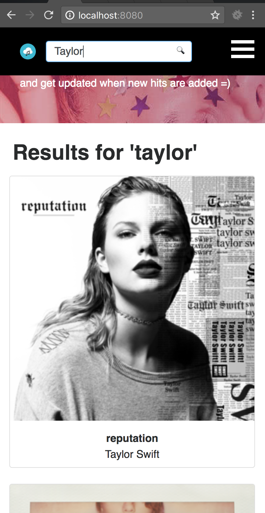

About
-----------------------------------
WeeCare has decided to spin off a business unit dedicated to recommending top music albums to our user base.

The Design and Frontend team has scaffolded some initial layouts and source code, but the application still needs some work to be presented at the next Product + Engineering meeting.

There is no set time limit, but we recommend completing the exercise to accurately represent your current skill set.

Recommendations Before Starting
-----------------------------------
- Read the requirements carefully to ensure we are building/solving for the requested feature.
- Browse the source code to get a feel for the file structure. Feel free to make changes as you see fit, including the configuration files, frameworks, packages, language, etc.
- If you are unable to complete a requirement, document your thoughts below the respective requirement/question in this readme.

Requirements
-----------------------------------
- Use the JSON data from the itunes API to populate album tiles in the grid view. The route to the itunes API: `https://itunes.apple.com/us/rss/topalbums/limit=100/json`
- Add functional `Artists` and `Categories` filters, when clicked: filter the album grid results by the album's `im:artist` and `category` properties
- Add any CSS to the appropriate files so that the UI matches the **Completed Desktop View** and **Completed Mobile View** below
- Add functional search input, that does some basic text search filtering on all the records. You may clear any preexisting applied filters when a text search is performed.

Questions
-----------------------------------
Upon completing the above functionality, the Frontend team will sync on the following questions. Please provide your input below each question. If time permits, implement your recommendation in the submission:
- How would you go about drilling into a dedicated album view when an album tile is clicked (consider technical implementations, usability, accessibility, and SEO)?

- Are there any optimizations that can be made to improve frontend performance?

- What testing frameworks should we add to prevent bugs and regressions?

- What tools would you recommend for the team to monitor errors, exceptions, and perform general profiling on our application?

Deploying Locally
-----------------------------------
- ensure you have node `v16.4.0` or higher, and npm `7.18.1` or higher installed in your dev environment. See resource for installing npm locally: https://nodejs.org/en/download/package-manager/
- run `git clone git@github.com:weecareinc/weecare-frontend-challenge.git`
- run `cd weecare-frontend-challenge`
- run `npm install`
- run `npm run build`
- run `npm start`
- open `http://localhost:8080/` in your preferred browser to ensure the application is loading properly

Submitting
-----------------------------------
When you are ready to submit, zip the `weecare-frontend-challenge` directory and email back to the hiring manager you are in contact with.

Completed Desktop View:
-----------------------------------

Completed Mobile View:
-----------------------------------

